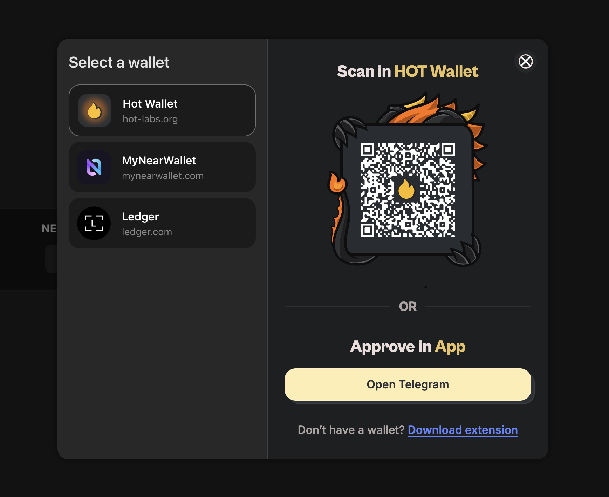

# NEAR Connect



Zero-dependenices, robust, secure and lightweight wallet connector for the NEAR blockchain with **easily updatable** wallets code

`yarn add @hot-labs/connector`

## How it works

Unlike near-wallet-selector, this library provides a secure execution environment for integrating wallets. This eliminates the need for a single registry of code for all wallets.

## Dapp integration

```ts
import { NearConnector } from "@hot-labs/connector";

const connector = new NearConnector({ network: "mainnet" });

connector.on("wallet:signOut", async () => {});
connector.on("wallet:signIn", async (t) => {
  const wallet = await connector.wallet(); // api like near-wallet-selector
  const address = t.accounts[0].accountId;
  wallet.signMessage(); // all methods like near-wallet-selector
});
```

## Wallet integration

The developer writes a self-hosted script that implements the integration of their wallet and adds a description to the common [manifest](./repository/manifest.ts):

```json
{
  "id": "hot-wallet",
  "version": "1.0.0",
  "name": "HOT Wallet",
  "description": "Secure Multichain wallet. Manage assets, refuel gas, and mine $HOT on any device with HOT Wallet",
  "icon": "https://app.hot-labs.org/images/hot/hot-icon.png",
  "website": "https://hot-labs.org/wallet",

  "executor": "https://raw.githubusercontent.com/hot-dao/near-selector/refs/heads/main/repository/hotwallet.js",
  "type": "sandbox",

  "platform": {
    "android": "https://play.google.com/store/apps/details?id=app.herewallet.hot&hl=en",
    "ios": "https://apps.apple.com/us/app/hot-wallet/id6740916148",
    "chrome": "https://chromewebstore.google.com/detail/hot-wallet/mpeengabcnhhjjgleiodimegnkpcenbk",
    "firefox": "https://addons.mozilla.org/en-US/firefox/addon/hot-wallet",
    "tga": "https://t.me/hot_wallet"
  },

  "features": {
    "signMessage": true,
    "signTransaction": true,
    "signAndSendTransaction": true,
    "signAndSendTransactions": true,
    "signInWithoutAddKey": true,
    "verifyOwner": false,
    "testnet": false
  },

  "permissions": {
    "storage": true,
    "open": {
      "allows": [
        "https://hot-labs.org",
        "https://t.me/hot_wallet",
        "https://play.google.com",
        "https://apps.apple.com",
        "hotwallet://"
      ]
    }
  }
}
```

The `executor` endpoint called in a standalone iframe if the user decides to use this wallet on the site. The script implements the [NearWallet](./src/types/wallet.ts) wallet class and registers it in a special object
`window.selector.ready(yourNearWallet)`

After that, the library delegates user requests directly to `yourNearWallet` via `iframe.postMessage` communication.
In addition, the script has the ability to draw any UI in the area allocated for the iframe that is necessary for interaction with the wallet.

## Sandbox limitations

For security, the wallet script runs in a sandboxed iframe, which has many limitations. It cannot call modals or access an external page or use localStorage.
The `window.selector` implements some features for this:

```ts
interface NearSelector {
  location: string; // initial dapp location href
  ready: (wallet: any) => void; // must call executor script for register wallet
  open: (url: string, newTab = false) => void; // used for my-near-wallet

  // use instead of localStorage
  storage: {
    set: (key: string, value: string) => Promise<void>;
    get: (key: string) => Promise<string>;
    remove: (key: string) => Promise<void>;
    keys: () => Promise<string[]>;
  };
}
```

## Manifest permissions

- `{ "storage": true  }`: Use window.selector.storage in execution script
- `{ "open": { allows: ["https://wallet.app"] } }` Use window.selector.open for `allow` domains
- `{ "location": true }`: Use window.selector.location for initial url from dapp
- `{ "usb": true }`: Use usb in execution script (use for Ledger)
- `{ "hid": true }`: Use hid in execution script (use for Ledger)

## Manifest features

Each wallet must specify in the manifest a list of features that are supported.
This will help dApps filter wallets by the required features. As soon as the wallet starts supporting the required feature -- it simply adds it to the manifest and updates its execution script, all dapps automatically download the updates without the need to update the frontend.

```ts
const selector = new NearConnector({
  // Show wallets that support signMessage and testnet env
  features: { signMessage: true, testnet: true },
});
```

## Injected wallets

Like [Ethereum Multi Injected Provider Standart](https://eips.ethereum.org/EIPS/eip-6963) this library supports injected wallets for extenstions and in-app browsers. Your injection script can dispatch custom event with your wallet:

```js
class NearWallet {
  manifest: { ... };
  signIn() {}
  // all implementation
}

window.addEventListener("near-selector-ready", () => {
  window.dispatchEvent(new CustomEvent("near-wallet-injected", { detail: new NearWallet() }));
});
```

## Background

Maintaining the current near-wallet-selector takes a lot of time and effort, wallet developers wait a long time to get an update to their connector inside a monolithic code base. After which they can wait months for applications to integrate their wallet into their site or update their frontend to update the wallet connector. This requires a lot of work on the review side of the near-wallet-selector team and STILL does not ensure the security of internal packages that will be installed in applications (for example, RHEA Finance or Near Intents).
All these problems prompted us to write a new solution that will:

1. safely and isolatedly execute the code for connecting to wallets
2. quickly and conveniently update wallets on all sites
3. Save the internal near-wallet-selector team from endlessly maintaining a huge code base, because now only the wallet itself is responsible for the connection of each wallet and hosts its script wherever it wants.

## Milestones

- Support all near-wallet-selector wallets
- Custom manifests for debugging mode
- Full backward compatibility with near-wallet-selector
